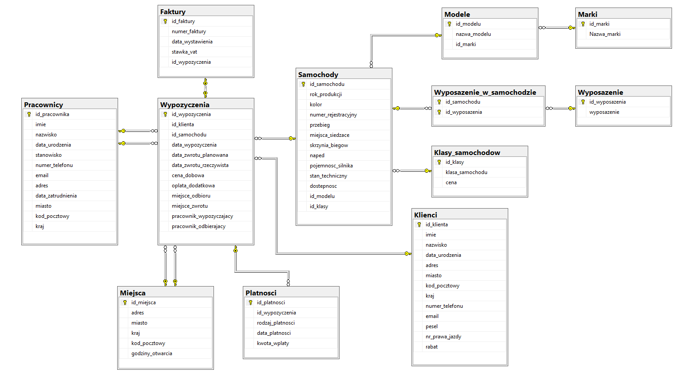

# Projekt Bazy Danych
 

<!-- <style>
 p,li {
    font-size: 12pt;
  }
</style>  -->

<!-- <style>
 pre {
    font-size: 8pt;
  }
</style>  -->


---


**Temat:** Wypożyczalnia samochodów

**Autorzy:** Katarzyna Studnicka, Wiktor Piotrowski, Grzegorz Szczurek, Dawid Czesak

--- 

# 1.  Zakres i krótki opis systemu
Naszym celem jest stworzenie systemu zarządzania wypożyczalnią samochodów, który umożliwi zarządzanie procesem wypożyczania. System ten będzie stanowił miejsce, w którym przechowywane będą wszystkie informacje związane z flotą samochodową, klientami oraz pracownikami. 
### Opis systemu

- Flota samochodowa: Baza danych będzie zawierała informacje o dostępnych samochodach do wypożyczenia, takie jak marka, model, rok produkcji, numer rejestracyjny, klasa samochodu, dostępność, przebieg, sprawność samochodu.
    
- Klienci: System będzie śledził dane klientów, w tym ich imiona, nazwiska, adresy, numery telefonów, adresy e-mail, historię wypożyczeń, a także informacje o ewentualnych zaległościach finansowych.

- Pracownicy: Baza danych będzie przechowywała dane o pracownikach wypożyczalni, takie jak imiona, nazwiska, stanowiska, numery identyfikacyjne, numery telefonów, daty zatrudnienia, email, uprawnienia (np. do wystawiania umów najmu).

- Klient może zarezerwować samochód osobiście w wypożyczalni.

- Klient może dokonać rezerwacji, podając swoje dane osobowe (imię i nazwisko, pesel, adres, numer telefonu, numer prawa jazdy).

- W dniu odbioru klient zgłasza się do wypożyczalni z dokumentem tożsamości i prawem jazdy.

- Klient może przedłużyć okres wypożyczenia, jeśli samochód jest dostępny i po uzgodnieniu nowych warunków z wypożyczalnią.

- W dniu zwrotu klient zgłasza się do wypożyczalni z wypożyczonym samochodem.


# 2.	Wymagania i funkcje systemu
### Wymagania funkcjonalne:
- Dodawanie i usuwanie klientów z bazy danych.
- Wypożyczanie samochodu na określony okres.
- Generowanie faktur na podstawie danych o wypożyczeniach.
- Zarządzanie stanem floty (dostępność).
- Wyszukiwanie danych po różnych kryteriach (np. imię i nazwisko klienta, numer rejestracyjny samochodu, data wypożyczenia)
- Historia wypożyczeń dla każdego klienta

# 3.	Projekt bazy danych

## Schemat bazy danych




## Opis poszczególnych tabel

# Nazwa tabeli: Klienci
- Opis: (Tabela "Klienci" przechowuje informacje o klientach firmy.)

| Nazwa atrybutu | Typ            | Opis/Uwagi                                      |
|----------------|----------------|-------------------------------------------------|
| id_klienta     | int            | klucz główny tabeli                             |
| imie           | nvarchar(50)   | imie klienta                                    |
| nazwisko       | nvarchar(100)  | nazwisko klienta                                |
| data_urodzenia | date           | data urodzenia klienta                          |
| adres          | nvarchar(255)  | adres klienta                                   |
| miasto         | nvarchar(50)   | miasto klienta                                  |
| kod_pocztowy   | nvarchar(20)   | kod pocztowy klienta                            |
| kraj           | nvarchar(50)   | kraj pochodzenia klienta                        |
| numer_telefonu | nvarchar(20)   | numer telefonu klienta                          |
| email          | nvarchar(100)  | email klienta                                   |
| pesel          | nvarchar(11)   | pesel klienta, który składa się tylko z 11 cyfr |
| rabat          | decimal(3,2)   | rabat przypisany do klienta                     |
| nr_prawa_jazdy | nvarchar(50)   | numer prawa jazdy klienta                       |


# Nazwa tabeli: Miejsca
- Opis: (Tabela "Miejsca" przechowuje informacje o różnych lokalizacjach wypożyczalni.)

| Nazwa atrybutu   | Typ          | Opis/Uwagi                                  |
|------------------|--------------|---------------------------------------------|
| id_miejsca       | int          | klucz główny tabeli                         |
| adres            | nvarchar(30) | adres wypżyczalni                           |
| miasto           | nvarchar(20) | miasto, w którym znajduje się wypożyczalnia |
| kraj             | nvarchar(20) | kraj, w którym znajduje się wypożyczalnia   |
| kod_pocztowy     | nvarchar(30) | kod pocztowy wypożyczalni                   |
| godziny_otwarcia | int          | godziny otwarcia wypożyczalni               |


# Nazwa tabeli: Platnosci
- Opis: (Tabela "Płatności" przechowuje informacje o płatnościach za wypożyczenia samochodów.)

| Nazwa atrybutu   | Typ           | Opis/Uwagi                                 |
|------------------|---------------|--------------------------------------------|
| id_platnosci     | int           | klucz główny tabeli                        |
| id_wypozyczenia  | int           | klucz obcy z tabeli "Wypozyczenia"         |
| rodzaj_platnosci | nvarchar(20)  | rodzaj płatności za wypozyczenie samochodu |
| data_platnosci   | date          | data zapłacenia za wypożyczony samochód    |
| kwota_wplaty     | decimal(10,2) | kwota za wypożyczenie samochodu            |

# Nazwa tabeli: Pracownicy
- Opis: (Tabela "Pracownicy" przechowuje informacje o pracownikach firmy.)

| Nazwa atrybutu    | Typ            | Opis/Uwagi                                  |
|-------------------|----------------|---------------------------------------------|
| id_pracownika     | int            | klucz główny tabeli                         |
| imie              | nvarchar(50)   | imię pracownika                             |
| nazwisko          | nvarchar(50)   | nazwisko pracownika                         |
| data_urodzenia    | date           | data urodzenia pracownika                   |
| stanowisko        | nvarchar(50)   | stanowisko pracownika                       |
| numer_telefonu    | nvarchar(20)   | numer telefonu pracownika                   |
| email             | nvarchar(100)  | email pracownika                            |
| adres             | nvarchar(255)  | adres pracownika                            |
| miasto            | nvarchar(50)   | miasto w którym mieszka pracownik           |
| kod_pocztowy      | nvarchar(20)   | kod pocztowy zamieszkania pracownika        |
| kraj              | nvarchar(20)   | kraj w którym mieszka pracownik             |
| data_zatrudnienia | date           | data zatrudnienia pracownika w wypożyczalni |

# Nazwa tabeli: Wypozyczenia
- Opis: (Tabela "Wypożyczenia" przechowuje informacje o wypożyczeniach samochodów.)

| Nazwa atrybutu          | Typ           | Opis/Uwagi                                 |
|-------------------------|---------------|--------------------------------------------|
| id_wypozyczenia         | int           | klucz główny tabeli                        |
| id_klienta              | int           | klucz obcy z tabeli Klienci                |
| id_samochodu            | int           | klucz obcy z tabeli Samochody              |
| data_wypozyczenia       | date          | data wypozyczenia samochodu                |
| data_zwrotu_planowana   | date          | planowana data zwrotu samochodu            |
| data_zwrotu_rzeczywsita | date          | rzeczywista data zwrotu samochodu          |
| cena_dobowa             | decimal(10,2) | cana całkowita wypożyczenia                |
| oplata_dodatkowa        | decimal(10,2) | opłaty dodatkowe                           |
| miejsce_odbioru         | int           | miejsce gdzie klient odebrał samochud      |
| miejsce_zwrotu          | int           | miejsce zwrotu samochodu                   |
| pracownik_wypozyczajacy | int           | pracownik odbierający wypożyczony samochód |
| pracownik_odbierajacy   | int           | pracownik odbierający wypożyczony samochód |
| status                  | nvarchar(20)  | status wypożyczenia                        |

# Nazwa tabeli: Samochody
- Opis: (Tabela "Samochody" przechowuje informacje o samochodach dostępnych do wypożyczenia.)

| Nazwa atrybutu      | Typ          | Opis/Uwagi                                                                  |
|---------------------|--------------|-----------------------------------------------------------------------------|
| id_samochodu        | int          | klucz główny tabeli                                                         |
| rok_produkcji       | int          | rok produckji samochodu                                                     |
| kolor               | nvarchar(20) | kolor samochodu                                                             |
| numer_rejestracyjny | nvarchar(20) | numer rejestracyjny samochodu                                               |
| przebieg            | int          | przebieg samochodu                                                          |
| miejsca_siedzące    | int          | liczba miejsc siedzących w samochodzie                                      |
| skrzynia_biegow     | nvarchar(3)  | skrzynia biegów w samochodzie                                               |
| naped               | nvarchar(4)  | dostępny napęd w samochodzie, mozliwe do wpisania tylko "FWD", "RWD", "AWD" |
| pojemnosc_silnika   | decimal(3,1) | pojemność silnika w samochodzie                                             |
| stan_techniczny     | nvarchar(20) | stan techniczny samochodu, (sprawny, niesprawny)                            |
| dostepnosc          | nvarchar(20) | dostępność samochodu w wypożyczalni, (dostępny, niedostępny)                |
| id_klasy            | int          | klucz obcy z tabeli Klasy_samochodow                                        |
| id_modelu           | int          | klcuz obcy z tabeli Modele                                                  |


# Nazwa tabeli: Wyposazenie_w_samochodzie
- Opis: (Tabela "Wyposażenie_w_samochodzie" tworzy relację wiele-do-wielu pomiędzy samochodami a ich wyposażeniem.)

| Nazwa atrybutu | Typ           | Opis/Uwagi                                                 |
|----------------|---------------|------------------------------------------------------------|
| id_samochodu   | int           | klucz główny tabeli oraz klucz obcy do tabeli samochody    |
| id_wyposazenia | int           | klucz główny tabeli oraz klucz obcy do tabeli wyposarzenie |


# Nazwa tabeli: Wyposazenie
- Opis: (Tabela "Wyposażenie" przechowuje informacje o różnych rodzajach wyposażenia dostępnych w samochodach.)

| Nazwa atrybutu | Typ           | Opis/Uwagi                         |
|----------------|---------------|------------------------------------|
| id_wyposazenia | int           | klucz główny tabeli                |
| wyposazenie    | nvarchar(100) | wyposażenie dostpene w samochodzie |

# Nazwa tabeli: Modele
- Opis: (Tabela "Modele" przechowuje informacje o różnych modelach samochodów.)

| Nazwa atrybutu | Typ          | Opis/Uwagi                |
|----------------|--------------|---------------------------|
| id_modelu      | int          | klucz główny tabeli       |
| nazwa_modelu   | nvarchar(50) | nazwa modelu samochodu    |
| id_marki       | int          | klucz obcy z tabeli Marki |

# Nazwa tabeli: Marki
- Opis:  Tabela "Marki" przechowuje informacje o różnych markach samochodów.)

| Nazwa atrybutu | Typ          | Opis/Uwagi            |
|----------------|--------------|-----------------------|
| id_marki       | int          | klucz główny tabeli   |
| nazwa_marki    | nvarchar(50) | nazwa marki samochodu |

# Nazwa tabeli: Faktury
- Opis: (Tabela "Faktury" przechowuje informacje o wystawionych fakturach dla wypożyczeń samochodów.)

| Nazwa atrybutu   | Typ          | Opis/Uwagi                       |
|------------------|--------------|----------------------------------|
| id_faktury       | int          | klucz główny tabeli              |
| numer_faktury    | nvarchar(20) | numer wystawionej fakrury        |
| data_wystawienia | date         | data wystawienia faktury         |
| id_wypozyczenia  | int          | klucz obcy z tabeli Wypozyczenia |
| stawka_vat       | decimal(3,2) | stawka vat = 23%                 |


# Nazwa tabeli: Klasy_samochodowe
- Opis: (Tabela "Klasy_samochodowe" przechowuje informacje o klasie samochodu i jego cenie.)

| Nazwa atrybutu  | Typ           | Opis/Uwagi                      |
|-----------------|---------------|---------------------------------|
| id_klasy        | int           | klucz główny tabeli             |
| klasa_samochodu | nvarchar(15)  | klas samochodu                  |
| cena            | decimal(10,2) | cena samochodu zalezna od klasy |

# 4.	Implementacja

## Kod poleceń DDL

* **Kod tworzenia tabeli "Klienci"**
```sql
create table Klienci
(
    id_klienta     int identity
        constraint id_klienta_pk
            primary key,
    imie           nvarchar(50)  not null,
    nazwisko       nvarchar(100) not null,
    data_urodzenia date          not null,
    adres          nvarchar(255) not null,
    miasto         nvarchar(50)  not null,
    kod_pocztowy   nvarchar(20),
    kraj           nvarchar(50),
    numer_telefonu nvarchar(20)  not null,
    email          nvarchar(100),
    pesel          nvarchar(11)
        constraint CK_Pesel
            check ([pesel] IS NULL OR [pesel] like '[0-9][0-9][0-9][0-9][0-9][0-9][0-9][0-9][0-9][0-9][0-9]'),
    nr_prawa_jazdy nvarchar(50)  not null,
    rabat          decimal(3, 2)
)
go
```
* **Kod tworzenia tabeli "Pracownicy"**
```sql
create table Pracownicy
(
    id_pracownika     int identity
        primary key,
    imie              nvarchar(50) not null,
    nazwisko          nvarchar(50) not null,
    data_urodzenia    date,
    stanowisko        nvarchar(50) not null,
    numer_telefonu    nvarchar(20),
    email             nvarchar(100),
    adres             nvarchar(255),
    data_zatrudnienia date         not null,
    miasto            nvarchar(50),
    kod_pocztowy      nvarchar(20),
    kraj              nvarchar(20)
)
go
```
* **Kod tworzenia tabeli "Wypozyczenia"**
```sql
create table Wypozyczenia
(
    id_wypozyczenia         int identity
        primary key,
    id_klienta              int            not null
        constraint Wypozyczenia_Klienci_id_klienta_fk
            references Klienci,
    id_samochodu            int            not null
        constraint Wypozyczenia_Samochody_id_samochodu_fk
            references Samochody,
    data_wypozyczenia       date           not null,
    data_zwrotu_planowana   date           not null,
    data_zwrotu_rzeczywista date,
    cena_dobowa             decimal(10, 2) not null
        constraint CK_Cena_Dobowa
            check ([cena_dobowa] >= 0),
    oplata_dodatkowa        decimal(10, 2)
        constraint CK_Oplata_Dodatkowa
            check ([oplata_dodatkowa] IS NULL OR [oplata_dodatkowa] > 0),
    miejsce_odbioru         int            not null
        constraint Wypozyczenia_Miejsca_id_miejsca_fk
            references Miejsca,
    miejsce_zwrotu          int            not null
        constraint Wypozyczenia_Miejsca_id_miejsca_fk_2
            references Miejsca,
    pracownik_wypozyczajacy int            not null
        constraint Wypozyczenia_Pracownicy_id_pracownika_fk
            references Pracownicy,
    pracownik_odbierajacy   int            not null
        constraint Wypozyczenia_Pracownicy_id_pracownika_fk_2
            references Pracownicy,
    constraint CK_Data_Zwrotu_Planowana
        check ([data_zwrotu_planowana] >= [data_wypozyczenia]),
    constraint CK_Data_Zwrotu_Rzeczywista
        check ([data_zwrotu_rzeczywista] IS NULL OR [data_zwrotu_rzeczywista] >= [data_wypozyczenia])
)
go
```
* **Kod tworzenia tabeli "Miejsca"**
```sql
create table Miejsca
(
    id_miejsca       int identity
        constraint id_miejsca_pk
            primary key,
    adres            nvarchar(30) not null,
    miasto           nvarchar(20) not null,
    kraj             nvarchar(20) not null,
    kod_pocztowy     nvarchar(30) not null,
    godziny_otwarcia nvarchar(30) not null
)
go
```
* **Kod tworzenia tabeli Faktury**
```sql
create table Faktury
(
    id_faktury       int identity
        constraint id_faktury_pk
            primary key,
    numer_faktury    nvarchar(20)  not null,
    data_wystawienia date          not null,
    stawka_vat       decimal(3, 2) not null
        constraint CK_stawka_vat
            check ([stawka_vat] >= 0),
    id_wypozyczenia  int           not null
        constraint Faktury_Wypozyczenia_id_wypozyczenia_fk
            references Wypozyczenia
)
go

create unique index IX_Faktury
    on Faktury (id_wypozyczenia)
go
```
* **Kod tworzenia tabeli "Marki"**
```sql
create table Marki
(
    id_marki    int identity
        constraint Marki_pk
            primary key,
    Nazwa_marki nvarchar(50)
)
go
```
* **Kod tworzenia tabeli "Modele"**
```sql
create table Modele
(
    id_modelu    int identity
        constraint Modele_pk
            primary key,
    nazwa_modelu nvarchar(50),
    id_marki     int not null
        constraint Modele_Marki_id_marki_fk
            references Marki
)
go
```
* **Kod tworzenia tabeli "Platnosci"**
```sql
create table Platnosci
(
    id_platnosci     int identity
        constraint Platnosci_pk
            primary key,
    id_wypozyczenia  int
        constraint Platnosci_Wypozyczenia_id_wypozyczenia_fk
            references Wypozyczenia,
    rodzaj_platnosci nvarchar(20) not null,
    data_platnosci   date,
    kwota_wplaty     nvarchar(30)
        constraint CK_Kwota
            check ([kwota_wplaty] IS NULL OR [kwota_wplaty] >= 0)
)
go
```
* **Kod tworzenia tabeli "Samochody"**
```sql
create table Samochody
(
    id_samochodu        int identity
        constraint id_samochodu_pk
            primary key,
    rok_produkcji       int           not null,
    kolor               nvarchar(20)  not null,
    numer_rejestracyjny nvarchar(20)  not null,
    przebieg            int           not null
        constraint CK_Przebieg
            check ([przebieg] >= 0),
    miejsca_siedzace    int           not null
        constraint CK_Miejsca_Siedzace
            check ([miejsca_siedzace] > 0),
    skrzynia_biegow     nvarchar(3)   not null,
    naped               nvarchar(4)   not null
        constraint CK_naped
            check ([naped] = 'AWD' OR [naped] = 'RWD' OR [naped] = 'FWD'),
    pojemnosc_silnika   decimal(3, 1) not null,
    stan_techniczny     nvarchar(20)  not null
        constraint CK_stan_techniczny
            check ([stan_techniczny] = 'Niesprawny' OR [stan_techniczny] = 'Sprawny'),
    dostepnosc          nvarchar(20)  not null
        constraint check_dostępność
            check ([dostepnosc] = 'Niedostepny' OR [dostepnosc] = 'Dostepny'),
    id_modelu           int           not null
        constraint Samochody_Modele_samochodow_id_modelu_fk
            references Modele,
    id_klasy            int
        constraint Samochody_Klasy_samochodow_id_klasy_fk
            references Klasy_samochodow
)
go
```
* **Kod tworzenia tabeli "Wyposazenie"**
```sql
create table Wyposazenie
(
    id_wyposazenia int identity
        constraint id_wyposazenia_pk
            primary key,
    wyposazenie    nvarchar(100) not null
)
go
```
* **Kod tworzenia tabeli "Wyposazenie_w_samochodzie"**
```sql
create table Wyposazenie_w_samochodzie
(
    id_samochodu   int not null
        references Samochody,
    id_wyposazenia int not null
        references Wyposazenie,
    primary key (id_samochodu, id_wyposazenia)
)
go
```
* **Kod tworzenia tabeli "Klasy_samochodowe"**
```sql
create table Klasy_samochodow
(
    id_klasy        int identity
        constraint Klasy_samochodow_pk
            primary key,
    klasa_samochodu nvarchar(15)   not null,
    cena            decimal(10, 2) not null
        constraint CK_Cena_Positive
            check ([cena] > 0)
)
go
```
## Widoki
**1. Całkowity koszt najmu z rabatem**

Widok "V_CalkowityKosztNajmu_Z_Rabatem" został stworzony w celu obliczenia i zaprezentowania całkowitego kosztu wynajmu dla każdej transakcji wynajmu w bazie danych. 
Uwzględnia on zarówno koszty netto, jak i brutto, biorąc pod uwagę ewentualne rabaty przyznawane klientom.
```sql
CREATE VIEW V_CalkowityKosztNajmu_Z_Rabatem AS
SELECT
    W.id_wypozyczenia,
    W.cena_dobowa,
    DATEDIFF(day, W.data_wypozyczenia, W.data_zwrotu_rzeczywista) AS liczba_dni,
    W.oplata_dodatkowa,
    K.rabat,
    (W.cena_dobowa * DATEDIFF(day, W.data_wypozyczenia, W.data_zwrotu_rzeczywista) + ISNULL(W.oplata_dodatkowa, 0)) AS calkowity_koszt_netto,
    CASE
        WHEN K.rabat IS NULL THEN
            (W.cena_dobowa * DATEDIFF(day, W.data_wypozyczenia, W.data_zwrotu_rzeczywista) + ISNULL(W.oplata_dodatkowa, 0)) * (1 + 0.23)
        ELSE
            ROUND(((W.cena_dobowa * DATEDIFF(day, W.data_wypozyczenia, W.data_zwrotu_rzeczywista) + ISNULL(W.oplata_dodatkowa, 0)) * (1 - K.rabat)) * (1 + 0.23),2 )
    END AS calkowity_koszt_brutto
FROM
    dbo.Wypozyczenia W
LEFT JOIN
    dbo.Klienci K ON W.id_klienta = K.id_klienta
WHERE
    W.data_zwrotu_rzeczywista >= W.data_wypozyczenia;
GO
```

**2. Dosępność samochodów**

Widok "V_Dostepne_Samochody" został stworzony, aby dostarczyć informacje o wszystkich dostępnych samochodach w bazie danych. 
Widok łączy dane z trzech tabel: "Samochody", "Modele" oraz "Marki" i filtruje wyniki tak, aby pokazywały tylko te samochody,
które są aktualnie dostępne do wynajmu.
```sql
CREATE VIEW V_Dostepne_Samochody AS
SELECT
    S.id_samochodu,
    S.numer_rejestracyjny,
    S.rok_produkcji,
    S.kolor,
    S.przebieg,
    M.nazwa_modelu,
    MK.Nazwa_marki
FROM
    dbo.Samochody S
JOIN
    dbo.Modele M ON S.id_modelu = M.id_modelu
JOIN
    dbo.Marki MK ON M.id_marki = MK.id_marki
WHERE
    S.dostepnosc = 'Dostepny';
GO
```

**3. Klienci i ich liczba wypożyczeń**

Widok "V_Klienci_Z_Wypozyczeniami" przedstawia klientów wraz z liczbą dokonanych przez nich wypożyczeń.
Łączy on tabelę "Klienci" z tabelą "Wypozyczenia" za pomocą klucza id_klienta i grupuje wyniki, aby obliczyć liczbę wypożyczeń dla każdego klienta.
```sql
CREATE VIEW V_Klienci_Z_Wypozyczeniami AS
SELECT
    K.id_klienta,
    K.imie,
    K.nazwisko,
    COUNT(W.id_wypozyczenia) AS liczba_wypozyczen
FROM
    dbo.Klienci K
LEFT JOIN
    dbo.Wypozyczenia W ON K.id_klienta = W.id_klienta
GROUP BY
    K.id_klienta, K.imie, K.nazwisko;
```

**4. Samochody i ich klasy wraz z ceną**

Ten widok przedstawia szczegółowe informacje o samochodach wraz z ich klasą oraz ceną wynajmu. 
```sql
CREATE VIEW V_Samochody_Z_Klasa AS
SELECT
    S.id_samochodu,
    S.numer_rejestracyjny,
    S.rok_produkcji,
    S.kolor,
    S.przebieg,
    Ma.Nazwa_marki AS nazwa_marki,
    M.nazwa_modelu,
    K.klasa_samochodu,
    K.cena
FROM
    dbo.Samochody S
JOIN
    dbo.Modele M ON S.id_modelu = M.id_modelu
JOIN
    dbo.Marki Ma ON M.id_marki = Ma.id_marki
JOIN
    dbo.Klasy_samochodow K ON S.id_klasy = K.id_klasy;
```

**5. Informacje o fakturach**

Ten widok zawiera informacje o fakturach wraz z kwotami brutto za wypożyczenie. 
Łączy dane faktur z informacjami o kosztach wypożyczenia, uwzględniając rabaty i dodatkowe opłaty.
```sql
CREATE VIEW V_Faktury_Z_Kwota AS
SELECT
    F.id_faktury,
    W.id_wypozyczenia,
    F.numer_faktury,
    F.data_wystawienia,
    F.stawka_vat,
    W.cena_dobowa,
    W.oplata_dodatkowa,
    K.rabat,
    ROUND(KosztNajmu.calkowity_koszt_brutto, 2) AS kwota
FROM
    dbo.Faktury F
JOIN
    dbo.Wypozyczenia W ON F.id_wypozyczenia = W.id_wypozyczenia
JOIN
    dbo.V_CalkowityKosztNajmu_Z_Rabatem KosztNajmu ON F.id_wypozyczenia = KosztNajmu.id_wypozyczenia
JOIN
    dbo.Klienci K ON K.id_klienta = W.id_klienta;
```

**6. Sprawdzanie płatności**

Ten widok służy do sprawdzania statusu płatności za wypożyczenia. 
Umożliwia porównanie wpłaconych kwot z oczekiwanymi kwotami brutto za wypożyczenie i identyfikację ewentualnych różnic.
```sql
CREATE VIEW V_Sprawdzenie_Platnosci AS
SELECT
    P.id_platnosci,
    P.id_wypozyczenia,
    P.kwota_wplaty,
    KosztNajmu.calkowity_koszt_brutto AS kwota_calkowita_brutto,
    CASE
        WHEN P.kwota_wplaty = KosztNajmu.calkowity_koszt_brutto THEN NULL
        ELSE P.kwota_wplaty - KosztNajmu.calkowity_koszt_brutto
    END AS status_platnosci
FROM
    dbo.Platnosci P
JOIN
    dbo.Wypozyczenia W ON P.id_wypozyczenia = W.id_wypozyczenia
JOIN
    dbo.Faktury F ON W.id_wypozyczenia = F.id_wypozyczenia
JOIN
    dbo.V_CalkowityKosztNajmu_Z_Rabatem KosztNajmu ON P.id_wypozyczenia = KosztNajmu.id_wypozyczenia;
```

## Procedury
**1. AktualizujStanSamochodu**

Procedura "AktualizujStanSamochodu" służy do aktualizacji kolumny stan_techniczny w tabeli Samochody na podstawie przekazanego identyfikatora samochodu (id_samochodu). 
```sql
CREATE PROCEDURE AktualizujStanSamochodu (
    @id_samochodu INT,
    @nowy_stan NVARCHAR(20)
)
AS
BEGIN
    UPDATE dbo.Samochody
    SET stan_techniczny = @nowy_stan
    WHERE id_samochodu = @id_samochodu;
END;
go
```
**Sposób urzycia:**
```sql
EXECUTE AktualizujStanSamochodu @id_samochodu = 11, @nowy_stan = 'Niesprawny';
```
**2. GenerujRaportWypozyczen**

Procedura "GenerujRaportWypozyczen" generuje raport wypożyczeń samochodów z uwzględnieniem określonego zakresu dat.
```sql
CREATE PROCEDURE GenerujRaportWypozyczen
    @data_od DATE,
    @data_do DATE
AS
BEGIN
    SELECT
        w.id_wypozyczenia,
        w.data_wypozyczenia,
        w.data_zwrotu_planowana,
        w.data_zwrotu_rzeczywista,
        w.cena_dobowa,
        w.oplata_dodatkowa,
        k.imie AS klient_imie,
        k.nazwisko AS klient_nazwisko,
        k.email AS klient_email,
        mo.nazwa_modelu AS samochod_model,
        ma.Nazwa_marki AS samochod_marka,
        s.numer_rejestracyjny AS samochod_numer_rejestracyjny,
        pw.imie AS pracownik_wypozyczajacy_imie,
        pw.nazwisko AS pracownik_wypozyczajacy_nazwisko,
        po.imie AS pracownik_odbierajacy_imie,
        po.nazwisko AS pracownik_odbierajacy_nazwisko,
        m1.adres AS miejsce_odbioru,
        m2.adres AS miejsce_zwrotu,
        p.rodzaj_platnosci,
        p.data_platnosci,
        CAST(p.kwota_wplaty AS DECIMAL(10, 2)) AS platnosc_kwota
    FROM
        dbo.Wypozyczenia w
        INNER JOIN dbo.Klienci k ON w.id_klienta = k.id_klienta
        INNER JOIN dbo.Samochody s ON w.id_samochodu = s.id_samochodu
        INNER JOIN dbo.Modele mo ON s.id_modelu = mo.id_modelu
        INNER JOIN dbo.Marki ma ON mo.id_marki = ma.id_marki
        INNER JOIN dbo.Pracownicy pw ON w.pracownik_wypozyczajacy = pw.id_pracownika
        INNER JOIN dbo.Pracownicy po ON w.pracownik_odbierajacy = po.id_pracownika
        INNER JOIN dbo.Miejsca m1 ON w.miejsce_odbioru = m1.id_miejsca
        INNER JOIN dbo.Miejsca m2 ON w.miejsce_zwrotu = m2.id_miejsca
        LEFT JOIN dbo.Platnosci p ON w.id_wypozyczenia = p.id_wypozyczenia
    WHERE
        w.data_wypozyczenia BETWEEN @data_od AND @data_do
    ORDER BY
        w.data_wypozyczenia;
END
go
```
**Sposób urzycia:**
```sql
EXEC GenerujRaportWypozyczen @data_od = '2022-01-01', @data_do = '2024-01-16';
```
**3. PobierzWypozyczeniaWDacie**

Procedura "PobierzWypozyczeniaWDacie" służy do pobierania informacji o wypożyczeniach samochodów w określonym przedziale dat.
```sql
CREATE PROCEDURE PobierzWypozyczeniaWDacie
    @data_od DATE,
    @data_do DATE
AS
BEGIN
    SELECT
        W.id_wypozyczenia,
        K.id_klienta,
        K.imie AS imie_klienta,
        K.nazwisko AS nazwisko_klienta,
        S.id_samochodu,
        S.numer_rejestracyjny,
        M.nazwa_modelu,
        Ma.Nazwa_marki AS marka,
        W.data_wypozyczenia,
        W.data_zwrotu_planowana,
        W.data_zwrotu_rzeczywista
    FROM
        dbo.Wypozyczenia W
    JOIN
        dbo.Klienci K ON W.id_klienta = K.id_klienta
    JOIN
        dbo.Samochody S ON W.id_samochodu = S.id_samochodu
    JOIN
        dbo.Modele M ON S.id_modelu = M.id_modelu
    JOIN
        dbo.Marki Ma ON M.id_marki = Ma.id_marki
    WHERE
        W.data_wypozyczenia BETWEEN @data_od AND @data_do
        OR W.data_zwrotu_planowana BETWEEN @data_od AND @data_do
        OR (@data_od BETWEEN W.data_wypozyczenia AND W.data_zwrotu_planowana)
        OR (@data_do BETWEEN W.data_wypozyczenia AND W.data_zwrotu_planowana);
END
GO
```
**Sposób urzycia:**
```sql
EXECUTE PobierzWypozyczeniaWDacie @data_od = '2024-01-01', @data_do = '2024-01-16';
```
**4. SprawdzDostepnoscSamochodow**

Procedura "SprawdzDostepnoscSamochodow" służy do sprawdzania dostępności samochodów w określonym przedziale dat.
```sql
CREATE PROCEDURE SprawdzDostepnoscSamochodow
    @data_od DATE,
    @data_do DATE
AS
BEGIN
    SELECT
        s.id_samochodu,
        m.nazwa_modelu AS model,
        mk.Nazwa_marki AS marka,
        s.kolor,
        s.rok_produkcji,
        s.numer_rejestracyjny,
        s.przebieg,
        s.miejsca_siedzace,
        s.skrzynia_biegow,
        s.naped,
        s.pojemnosc_silnika,
        s.stan_techniczny
    FROM
        dbo.Samochody s
        INNER JOIN dbo.Modele m ON s.id_modelu = m.id_modelu
        INNER JOIN dbo.Marki mk ON m.id_marki = mk.id_marki
    WHERE
        s.dostepnosc = 'Dostepny'
        AND s.id_samochodu NOT IN (
            SELECT id_samochodu
            FROM dbo.Wypozyczenia
            WHERE
                (data_wypozyczenia BETWEEN @data_od AND @data_do)
                OR (data_zwrotu_planowana BETWEEN @data_od AND @data_do)
                OR (@data_od BETWEEN data_wypozyczenia AND data_zwrotu_planowana)
                OR (@data_do BETWEEN data_wypozyczenia AND data_zwrotu_planowana)
        );
END
go


```
**Sposób urzycia:**
```sql
EXEC SprawdzDostepnoscSamochodow @data_od = '2024-01-16', @data_do = '2024-01-20';
```
## Funkcje
**1. LacznyPrzychodOkres**

Funkcja LaczyPrzychodOkres służy do obliczania całkowitego przychodu z wypożyczeń samochodów w określonym przedziale dat.
```sql
CREATE FUNCTION LaczyPrzychodOkres(
    @data_od DATE,
    @data_do DATE
)
RETURNS DECIMAL(10, 2)
AS
BEGIN
    DECLARE @Przychod DECIMAL(10, 2);

    SELECT @Przychod = SUM(DATEDIFF(DAY, r.Data_Wypozyczenia, r.data_zwrotu_rzeczywista) * r.Cena_dobowa + ISNULL(r.Oplata_dodatkowa, 0))
    FROM dbo.Wypozyczenia r
    JOIN dbo.Samochody s ON r.id_samochodu = s.id_samochodu
    WHERE r.Data_Wypozyczenia BETWEEN @data_od AND @data_do;

    RETURN @Przychod;
END
GO
```
**Sposób urzycia:**
```sql
SELECT dbo.LaczyPrzychodOkres('2020-06-01', '2023-06-11') AS PrzychodZaOkres;
```
## Triggery
**1. SprawdzWiekKlienta**

Trigger sprawdzajacy wiek klienta kiedy nie am 18 lat nie mozemy dodac go do tabeli klienci
```sql
CREATE TRIGGER SprawdzWiekKlienta
ON dbo.Klienci
AFTER INSERT, UPDATE
AS
BEGIN
    IF EXISTS (
        SELECT 1
        FROM inserted
        WHERE DATEDIFF(YEAR, data_urodzenia, GETDATE()) < 18
    )
    BEGIN
        RAISERROR('Klient musi mieć co najmniej 18 lat.', 16, 1);
        ROLLBACK TRANSACTION;
        RETURN;
    END;
END;
GO
```
**2. ZapobiegajWystawianiuFaktru**

Trigger, ktory sprawdza poprzez sprawdzenie z widoku V_SPRAWDZENIE_PLATNOSCI, 
czy status płatnosci jest zaplacony jesli nie to nie pozwoli nam to dodan do tabeli faktury nowej faktury
```sql
CREATE TRIGGER ZapobiegajWystawianiuFaktru
ON dbo.Faktury
INSTEAD OF INSERT
AS
BEGIN
    IF EXISTS (
        SELECT 1
        FROM inserted i
        JOIN V_Sprawdzenie_Platnosci v ON i.id_wypozyczenia = v.id_wypozyczenia
        WHERE v.status_platnosci != 0
    )
    BEGIN
        RAISERROR('Nie można dodać faktury, jeśli płatnosć nie jest w pełni uregulowana.', 16, 1);
    END
    ELSE
    BEGIN
        INSERT INTO dbo.Faktury (numer_faktury, data_wystawienia, stawka_vat, id_wypozyczenia)
        SELECT numer_faktury, data_wystawienia, stawka_vat, id_wypozyczenia
        FROM inserted;
    END
END;
GO
```
